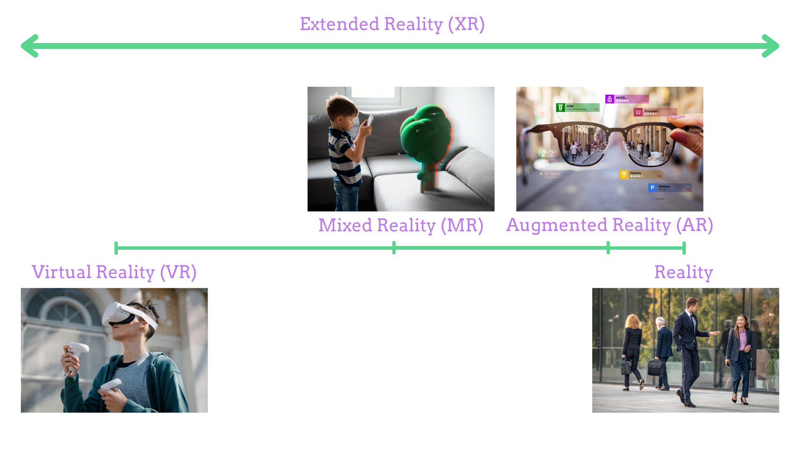
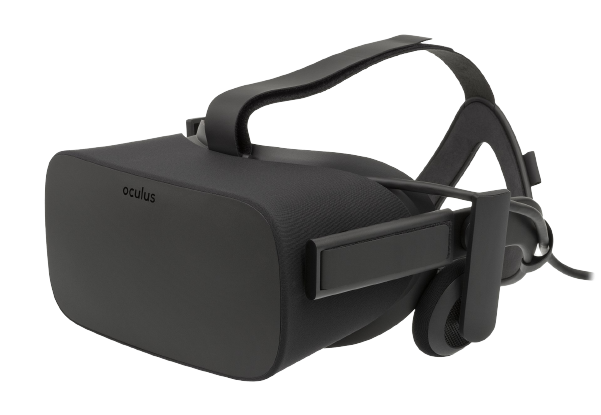
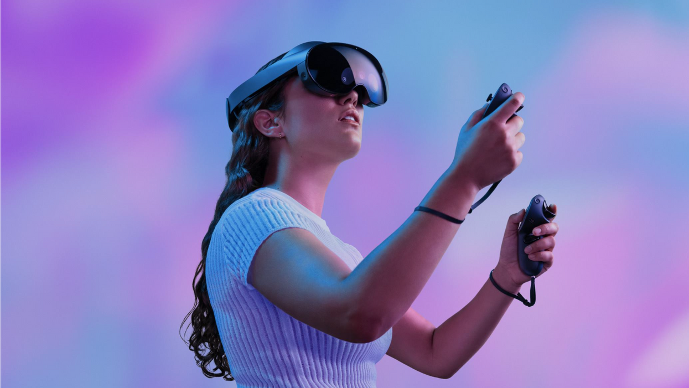
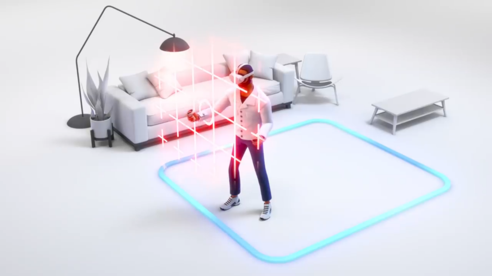
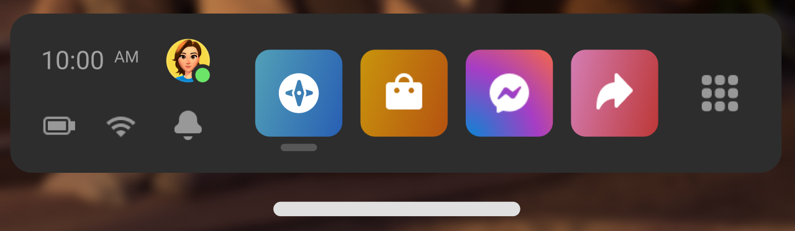
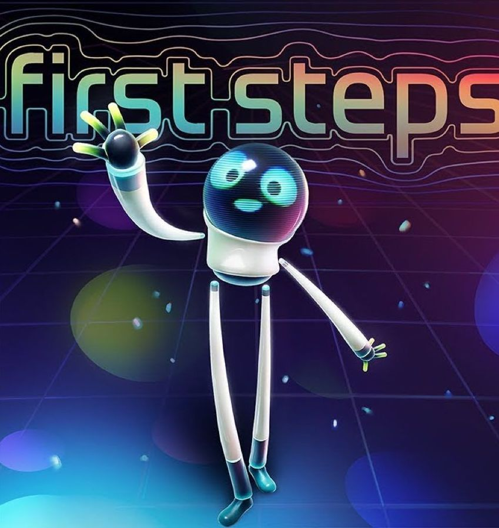
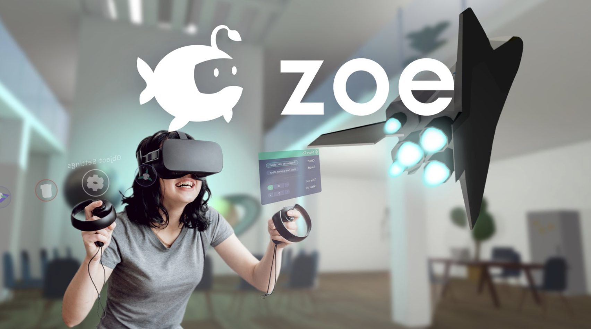

## Las posibilidades de la RV en orientación

---
## Las diferentes realidades

---
## ¿Qué es eso del metaverso?

---
## Un poco de contexto

Oculus fundada por Palmer Luckey en 2012 <!-- .element: class="fragment" -->

Oculus Rift necesitaba un ordenador <!-- .element: class="fragment" -->

 <!-- .element: class="fragment" -->

Adquirida por Facebook (Meta) en 2014

Versión standalone en 2017 (Oculus Go) <!-- .element: class="fragment" -->

Oculus Quest (2018) → Oculus Quest 2 (2020) → Meta Quest 2 (2021) <!-- .element: class="fragment" -->
---
## Actualidad

## Meta Quest Pro

Presentado en octubre <!-- .element: class="fragment" -->

Modo passthrough en color <!-- .element: class="fragment" -->

Capacidad para transmitir emociones <!-- .element: class="fragment" -->

Mandos mejorados <!-- .element: class="fragment" -->

Enfoque profesional <!-- .element: class="fragment" -->

Su precio es 1800€ <!-- .element: class="fragment" -->
---
## Futuro: Objetivos a alcanzar

Futuro del trabajo <!-- .element: class="fragment" -->

Futuro del ocio <!-- .element: class="fragment" -->

Futuro del deporte <!-- .element: class="fragment" -->

Futuro de la educación <!-- .element: class="fragment" -->
---
## Echa un vistazo

 <iframe title="Quest 2 Headset - FanArt" frameborder="0" allowfullscreen mozallowfullscreen="true" webkitallowfullscreen="true" allow="autoplay; fullscreen; xr-spatial-tracking" xr-spatial-tracking execution-while-out-of-viewport execution-while-not-rendered web-share width="640" height="480" src="https://sketchfab.com/models/ee496aa030bf4f37a52b445196796af3/embed?autostart=1"> </iframe> 

---
## Seguridad

Sistema guardián: límite fijo o con desplazamiento <!-- .element: class="fragment" -->

Abrazaderas y ajuste del casco

Percepción sensorial <!-- .element: class="fragment" -->

Posibilidad de mareo → Importancia del uso incremental <!-- .element: class="fragment" -->
---
## Oculus Home

---
## Lanza la primera aplicación

---
## ¿Cómo orientamos en Realidad Virtual?

Experiencia inmersiva en una determinada profesión

Posibilidad de grabación en realidad virtual <!-- .element: class="fragment" -->

Múltiples recursos para diferentes familias profesionales <!-- .element: class="fragment" -->

Y los que vendrán... <!-- .element: class="fragment" -->

## Creación de experiencias propias

Educa360 <!-- .element: class="fragment" -->

Zoe <!-- .element: class="fragment" -->

Ausencia de soluciones libres (Edorble) <!-- .element: class="fragment" -->

## Idiomas

[Mondly: Learn Languages in VR](https://www.oculus.com/experiences/quest/4214902388537196/?locale=es_ES)

Intercambios virtuales: [Meta Horizon Worlds](https://www.oculus.com/experiences/quest/2532035600194083/)

[ImmerseMe](https://immerseme.co)

## Formación y Orientación Laboral

[VirtualSpeech](https://www.oculus.com/experiences/quest/3973230756042512/?locale=es_ES)

[Spatial](https://www.oculus.com/experiences/quest/2927141310670477)

[Bodyswaps](https://www.oculus.com/experiences/quest/3714188128706579/?utm_source=oculusapplab.com)

## Química

[Molecule Builder](https://www.oculus.com/experiences/quest/3632813843496339/?utm_medium=share&utm_source=oculus)

[Nanome](https://www.oculus.com/experiences/rift/1873145426039242/)

## Artes gráficas

[Vermillion](https://www.oculus.com/experiences/quest/4900967296622279)

[Tilt Brush](https://www.oculus.com/experiences/quest/2322529091093901)

[SculptrVR](https://www.oculus.com/experiences/quest/1978992975501648)

## Fabricación mecánica

[Car Mechanic Simulator](https://www.oculus.com/experiences/quest/4178846312215481/)

[Machine Inspector](https://sidequestvr.com/app/545/machine-inspector)

[ShapesXR](https://www.oculus.com/experiences/quest/3899112273551602/)

## Informática

Videojuegos serios: [Crear experiencias educativas](https://www.zoe.com/software/zoe-for-unity/)

Web: [A-Frame](https://aframe.io)

[Desarrollo](https://developer.oculus.com/get-started-platform/)

## Espacios en los que encontrar experiencias inmersivas de diferentes profesiones

[Enlace a la tienda oficial](https://www.oculus.com/experiences/quest/)

Tiendas alternativas: [App Lab](https://applabgamelist.com/Best) o [SideQuest](https://sidequestvr.com/apps/education/1/rating)

Experiencias en la web: [WebVR Experiments](https://experiments.withgoogle.com/collection/webvr)

Una gran cantidad de vídeos en 360: [Explora en Realidad Virtual la fabricación de un coche Hyundai](https://www.youtube.com/watch?v=3XDjb2pPQDw)

Empresas dedicadas: [VRFP](https://www.vrfp.es), [Virtualware](https://www.virtualwareco.com/es/proyectos/)
---

<!-- .slide: data-background-video="../assets/vr.mp4" data-background-opacity="0.6" data-background-video-loop data-background-video-muted -->

## ¿Dudas?
---
## Cuestionario de evaluación