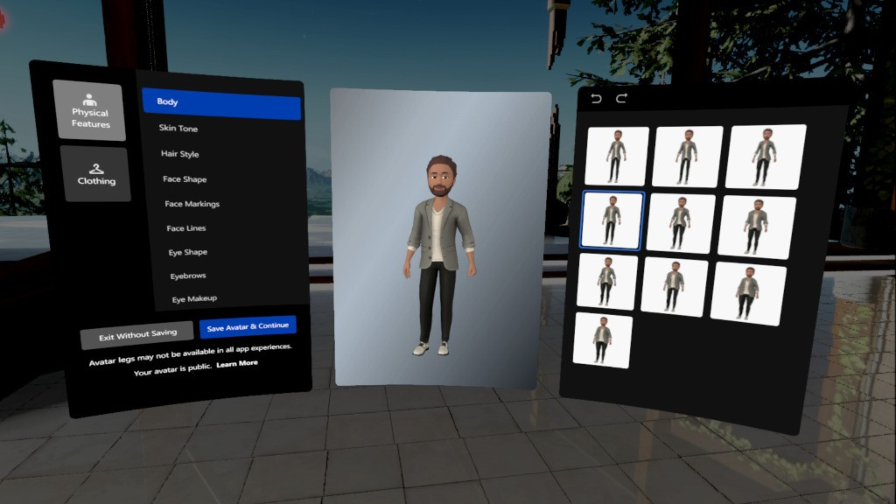

---
## Las diferentes realidades

---
## ¿Qué es eso del metaverso?

---
## Un poco de contexto

Oculus fundada por Palmer Luckey en 2012 <!-- .element: class="fragment" -->

Oculus Rift necesitaba un ordenador <!-- .element: class="fragment" -->

 <!-- .element: class="fragment" -->

Adquirida por Facebook (Meta) en 2014

Versión standalone en 2017 (Oculus Go) <!-- .element: class="fragment" -->

Oculus Quest (2018) → Oculus Quest 2 (2020) → Meta Quest 2 (2021) <!-- .element: class="fragment" -->
---
## Actualidad

## Meta Quest Pro

Presentado en octubre <!-- .element: class="fragment" -->

Modo passthrough en color <!-- .element: class="fragment" -->

Capacidad para transmitir emociones <!-- .element: class="fragment" -->

Mandos mejorados <!-- .element: class="fragment" -->

Enfoque profesional <!-- .element: class="fragment" -->

Su precio es 1800€ <!-- .element: class="fragment" -->
---
## Futuro: Objetivos a alcanzar

Futuro del trabajo <!-- .element: class="fragment" -->

Futuro del ocio <!-- .element: class="fragment" -->

Futuro del deporte <!-- .element: class="fragment" -->

Futuro de la educación <!-- .element: class="fragment" -->
---

## Hardware de Meta Quest 2

1 * 1832×3800 (1832×1920 por ojo) LCD <!-- .element: class="fragment" -->

72-90Hz (120Hz en fase experimental) <!-- .element: class="fragment" -->

Oculus Quest Store (posibilidad de usar Oculus Link) <!-- .element: class="fragment" -->

SOC Snapdragon XR2 <!-- .element: class="fragment" -->

6GB RAM <!-- .element: class="fragment" -->

128GB (de 350€ a 450€) / 256GB (de 450€ a 550€)

503g <!-- .element: class="fragment" -->

2 * Oculus Touch Controller (V3) <!-- .element: class="fragment" -->

2-3 horas batería <!-- .element: class="fragment" -->
---

## Echa un vistazo

 <iframe title="Quest 2 Headset - FanArt" frameborder="0" allowfullscreen mozallowfullscreen="true" webkitallowfullscreen="true" allow="autoplay; fullscreen; xr-spatial-tracking" xr-spatial-tracking execution-while-out-of-viewport execution-while-not-rendered web-share width="640" height="480" src="https://sketchfab.com/models/ee496aa030bf4f37a52b445196796af3/embed?autostart=1"> </iframe> 

---
## Seguridad

Sistema guardián: límite fijo o con desplazamiento <!-- .element: class="fragment" -->

Abrazaderas y ajuste del casco

Percepción sensorial <!-- .element: class="fragment" -->

Posibilidad de mareo → Importancia del uso incremental <!-- .element: class="fragment" -->
---
## Gestión de cuentas

Hasta hace poco asociada a Facebook <!-- .element: class="fragment" -->

Avatar asociado a la cuenta <!-- .element: class="fragment" -->

Posibilidad de multicuenta

Gestión desde app <!-- .element: class="fragment" -->
---
## Oculus Home

---
## Lanza la primera aplicación

---
## Soporte educativo

Control por transmisión en la app

Posibilidad de grabación en realidad virtual <!-- .element: class="fragment" -->

Múltiples recursos para diferentes materias <!-- .element: class="fragment" -->

Y los que vendrán... <!-- .element: class="fragment" -->

## ¿Cuándo usar VR en educación?

Falta de material (caro o escaso) <!-- .element: class="fragment" -->

Hay modelos o conceptos más fáciles de comprender en tres dimensiones <!-- .element: class="fragment" -->

Cambio de escala: universo, cuerpo humano, metáforas de dispositivos <!-- .element: class="fragment" -->

Localizaciones remotas <!-- .element: class="fragment" -->

Actividades peligrosas

Actividad manual que requiere pasos muy precisos <!-- .element: class="fragment" -->

Ambiente controlado para replicar acciones de forma individual <!-- .element: class="fragment" -->

## Creación de experiencias educativas

Educa360 <!-- .element: class="fragment" -->

Zoe <!-- .element: class="fragment" -->

Ausencia de soluciones libres (Edorble) <!-- .element: class="fragment" -->

## Idiomas

[Mondly: Learn Languages in VR](https://www.oculus.com/experiences/quest/4214902388537196/?locale=es_ES)

Intercambios virtuales: [Meta Horizon Worlds](https://www.oculus.com/experiences/quest/2532035600194083/)

[ImmerseMe](https://immerseme.co)

## Formación y Orientación Laboral

[VirtualSpeech](https://www.oculus.com/experiences/quest/3973230756042512/?locale=es_ES)

[Spatial](https://www.oculus.com/experiences/quest/2927141310670477)

[Bodyswaps](https://www.oculus.com/experiences/quest/3714188128706579/?utm_source=oculusapplab.com)

## Mecánica

[Car Mechanic Simulator](https://www.oculus.com/experiences/quest/4178846312215481/)

[Machine Inspector](https://sidequestvr.com/app/545/machine-inspector)

[Wrench](http://www.wrenchgame.com) (aún no standalone)

## Administrativo

[Horizon Workrooms](https://www.oculus.com/experiences/quest/2514011888645651/)

[ShapesXR](https://www.oculus.com/experiences/quest/3899112273551602/)

[Job Simulator](https://www.oculus.com/experiences/quest/3235570703151406/?locale=es_ES)

## Informática

Videojuegos serios: [Crear experiencias educativas](https://www.zoe.com/software/zoe-for-unity/)

Web: [A-Frame](https://aframe.io)

[Desarrollo](https://developer.oculus.com/get-started-platform/)

## Comercio y Marketing

[Crop Craze: Farming Simulator](https://www.oculus.com/experiences/quest/5617270104965437/?utm_source=sidequest)

[El cambio en la industria](https://business.trustedshops.es/blog/ejemplos-realidad-aumentada-realidad-virtual-estrategia-marketing/)

[Analítica VR en los comercios](https://cognitive3d.com/retail/)

## Servicios sociales y a la comunidad

[ZenVR](https://sidequestvr.com/app/5026/zenvr)

[Imercyve: Living with Intellectual Disability](https://sidequestvr.com/app/1902/imercyve-living-with-intellectual-disability)

[Sea Level Rise Explorer: Long Beach](https://sidequestvr.com/app/3784/sea-level-rise-explorer-long-beach)

[Everyday Inclusion - An Interactive Learning Journey About Unconscious Bias](https://sidequestvr.com/app/1262/everyday-inclusion-an-interactive-learning-journey-about-unconscious-bias)

## Más sobre educación

[Enlace a la tienda oficial](https://www.oculus.com/experiences/quest/)

Existen más alternativas: [App Lab](https://applabgamelist.com/Best) o [SideQuest](https://sidequestvr.com/apps/education/1/rating)

Experiencias en la web: [Access Mars](https://experiments.withgoogle.com/access-mars), [Speak to Go](https://experiments.withgoogle.com/speak-to-go) 

Una gran cantidad de vídeos en 360: [Viaje al interior del cuerpo humano](https://www.youtube.com/watch?v=d9D5csXovEM), [Tour por Londres](https://www.youtube.com/watch?v=m9EClKA1VeQ)

[Y esto solo acaba de empezar](https://www.desconsolados.com/2021/07/17/visita-albarracin-de-manera-virtual-gracias-a-vr-chat/)
---

<!-- .slide: data-background-video="../assets/vr.mp4" data-background-opacity="0.6" data-background-video-loop data-background-video-muted -->

## ¿Dudas?
---
## Actividad propuesta

Crea una actividad para llevar a cabo con el alumnado usando Realidad Virtual <!-- .element: class="fragment" -->

Busca una experiencia que puedas utilizar de base <!-- .element: class="fragment" -->

Piensa el objetivo didáctico <!-- .element: class="fragment" -->

Diseña la dinámica de forma que el alumnado que no está utilizando el dispositivo tenga un rol diferente <!-- .element: class="fragment" -->

Escanea el código QR para acceder a un listado de recursos en los que encontrar experiencias

## Exit Ticket

<small>https://app.wooclap.com/FNRJUJ/questionnaires/63ed418afc118c96e7ad57e1</small>